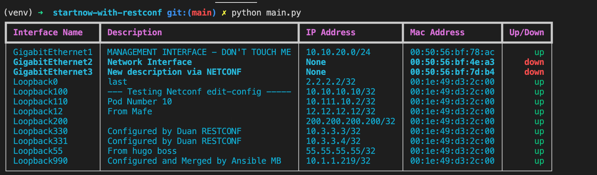

# StartNow-With-RESTCONF

This is a script that leverages `RESTCONF` and the [requests](https://docs.python-requests.org/en/latest/) library to gather Cisco IOS-XE device info. The script then outputs the results to a table in the terminal window. Use this script to improve your understanding of RESTCONF and python. While also learning how to leverage network automation to update your network documentation. Another note, if you need access to a lab environment you can have free access to the [Cisco DevNet Always-On Sandbox](https://devnetsandbox.cisco.com/RM/Diagram/Index/7b4d4209-a17c-4bc3-9b38-f15184e53a94?diagramType=Topology)

**Main.py gathers**:

- Interface Name
- Description
- IP/Subnet Mask
- Mac Address
- Interface Status
- Last Time Interface Modified

## Download the Code

To get started: Download the code and cd the `startnow-with-restconf` directory

```bash
git clone https://github.com/labeveryday/startnow-with-restconf.git
cd startnow-with-restconf
```

## Python Virtual Environment

When executing python code or installing python applications you should get into the practice of creating and managing python virtual environments.
This will allow you to run different versions of a python library while avoiding version conflicts. My preferred tool for python virtual environments is `venv`
There are tools out there. Remember to find what works best for you.

**On Linux or Mac**

```python
python3 -m venv venv
source venv/bin/activate
```

**On Windows**

```cmd
python3 -m venv venv
.\venv\Scripts\activate.bat
```

## Install project requirements

Once you have your virtual environment setup install the python libraries that are required for this repo.

```bash
pip install -r requirements.txt
```

## Example: Script in action

Now that you have everything installed and updated you can execute the script

```bash
python main.py
```

After the script successfully pulls data from the device the `table` will be updated and printed accordingly.

> NOTE: The modules used to gather data are `get_interfaces.py` and `get_operational.py`



### About me

Introverted Network Automation Engineer that is changing lives as a Developer Advocate for Cisco DevNet. Pythons scripts are delicious. Especially at 2am on a Saturday night.

My hangouts:

- [LinkedIn](https://www.linkedin.com/in/duanlightfoot/)

- [Twitter](https://twitter.com/labeveryday)
